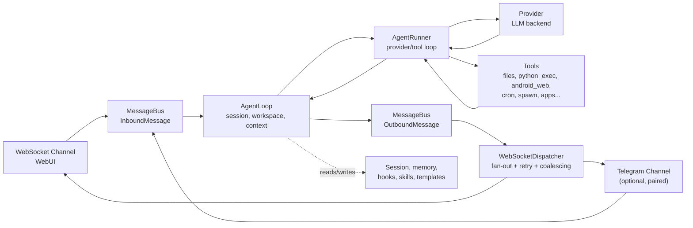

# Architecture

This page maps Jenny's runtime behavior to source files; use it when debugging internals, reviewing a PR, or adding a provider/channel/tool.

For the product-level mental model, read [Concepts](./concepts.md) first.

## Core flow



Main files:

| Area | Files |
|---|---|
| Message events and queue | `jenny/bus/events.py`, `jenny/bus/queue.py` |
| Turn orchestration | `jenny/agent/loop.py` (+ mixins: `turn_states.py`, `turn_persistence.py`, `loop_provider.py`, `loop_tasks.py`) |
| Provider/tool conversation loop | `jenny/agent/runner.py` (+ mixins: `request_execution.py`, `tool_execution.py`) |
| Context construction | `jenny/agent/context.py` |
| Session storage and compaction | `jenny/session/manager.py`, `jenny/agent/autocompact.py` |
| Long-term memory and Dream | `jenny/agent/memory.py` |
| Composition root | `jenny/runtime/container.py` (`GatewayContainer`) |
| Runtime state (workspace dir, Android context, config path override) | `jenny/runtime/context.py` (`RuntimeContext`) |

## Agent Loop vs Agent Runner

`AgentLoop` owns the channel-facing turn:

- receives inbound messages from the bus;
- determines the effective session and workspace scope (always the unified session on the WebUI/Telegram path; internal jobs use separate session keys);
- builds context (workspace files, skills, memory, recent messages, channel metadata);
- wires hooks, progress reporting, and channel metadata;
- publishes outbound messages back to the bus.

`AgentRunner` owns the model-facing loop:

- sends messages to the selected provider;
- handles streaming deltas and reasoning blocks;
- executes tool calls and feeds results back into the model;
- stops when a final answer is produced or a runtime limit is hit (`max_tool_iterations`, default `200`).

If a problem is about channel routing, session keys, workspace selection, or outbound delivery, start in `jenny/agent/loop.py`. If it is about provider calls, tool calls, streaming, or iteration limits, start in `jenny/agent/runner.py`.

## Providers

Providers are user-defined `ProviderConfig` entries in `jenny/config/schema.py` (`providers.providers`); there is no built-in provider catalog.

Provider selection and construction:

- `Config.get_active_provider()` returns the entry named by `providers.default`, otherwise the first entry in the list;
- `jenny/providers/factory.py::make_provider()` builds the backend from that entry's `format`: `"anthropic"` → `AnthropicProvider`, everything else → `OpenAICompatProvider` (with an `OpenAIResponsesConverter` path when `apiType` selects the Responses API);
- the backend is built once when the gateway starts (`GatewayContainer.build()`), **but it is not fixed for the process lifetime** — see the hot-reload note below.

**Provider and model changes made from the Settings screen apply without an app restart.** `GatewayContainer._on_settings_changed()` (`jenny/runtime/container.py`) is wired as a callback into the WebUI settings routes; when it fires it reloads `config.json`, rebuilds the provider via `make_provider()`, and — if the resolved model or the provider's `apiBase` actually changed — calls `agent._apply_provider_switch(new_provider, new_model, new_ctx)` to swap the live agent's provider and model in place. A restart is only needed when `config.json` is hand-edited on disk outside the Settings UI (nothing watches the file for external changes), or when a change is flagged `requires_restart` by the backend — `update_agent_settings()` in `jenny/webui/settings_api.py` sets that flag for `timezone`, `bot_name`, `bot_icon`, and `tool_hint_max_length` changes specifically (model/provider changes are not in that list and hot-reload as described above). As of this writing the WebUI never surfaces that flag to the user, so a restart-flagged change can silently need an app relaunch to take effect.

Provider implementations live in `jenny/providers/`. Most endpoints use the OpenAI-compatible implementation; Anthropic and the OpenAI Responses API (`jenny/providers/openai_responses/`) have specialized paths.

Useful docs:

- [Providers and models](../reference/providers.md) for practical setup;
- [Configuration reference](../reference/configuration.md#providers) for the exact schema.

## Channels

Jenny has **four** channels, all owned by `WebSocketDispatcher` (`jenny/channels/dispatcher.py`), which fans outbound bus messages out to whichever channels are active:

| Channel | File | Notes |
|---|---|---|
| WebSocket (WebUI) | `jenny/channels/websocket.py` (+ `ws_sender.py`, `ws_parsing.py`) | Always enabled on Android; serves the mobile WebUI over the same port as the HTTP API. |
| Telegram | `jenny/channels/telegram.py` | Optional, personal-bot channel; created only if `telegram.enabled` is true and a `bot_token` is set. Paired via a 6-digit code; it shares the single unified session with the WebUI, so `/new` from either one resets the other too. |
| Notification | `jenny/channels/notification.py` | Android only. A reply typed into one of Jenny's notifications comes in on this channel, and her answer goes back as a system alert. No connection of its own. |
| Floating | `jenny/channels/floating.py` | Android only. The floating mascot's bubble: what you type there comes in on this channel, and the answer is shown in the bubble. |

`WebSocketDispatcher` also owns retry, delta coalescing for streaming updates, and progress-message filtering per channel — see [`dispatcher.py`](../../jenny/channels/dispatcher.py). This is a decomposition, not a generic channel registry: the four channels are wired explicitly in `_init_channel()`/`_init_telegram()`/`_init_notification()`/`_init_floating()`, not discovered.

Useful docs:

- [Tour of the WebUI](../using/webui-tour.md);
- [Telegram bridge](../using/telegram.md);
- [WebSocket protocol](../reference/websocket.md) for wire-level details.

## WebUI and Gateway

The gateway (started by the Android runtime via `jenny.android_entry.run_gateway(data_dir, android_context, port=18790)`) starts:

- the WebSocket channel and, if configured, the Telegram channel (via `WebSocketDispatcher`);
- the workspace-scoped cron service;
- system jobs such as Dream and the heartbeat;
- the HTTP API routes under `/api/` (settings, apps, media, skills, wiki, transcript, backup...) served from the same asyncio process.

**There is no `/health` endpoint.** No route named `health` exists anywhere in `jenny/channels/` or `jenny/webui/`. On Android, `run_gateway()` forces `host="127.0.0.1"` and `port=18790` for both the WebSocket handshake and the HTTP API (`_apply_gateway_overrides()` in `jenny/gateway_runtime.py` sets `config.gateway.port`, `config.websocket["port"]`, and defaults `config.websocket["enabled"]` to `true`) — WebSocket and HTTP genuinely share one origin so the WebView can reach both without CORS. `gateway.port` defaults to `18790` in the schema; `websocket.port` independently defaults to `8765` and `websocket.enabled` defaults to `false` in `jenny/config/schema.py` — those are the desktop-testing defaults, and the Android entry point always overrides them at startup.

The packaged WebUI is served from `jenny/templates/ui/` and rendered inside the Android app's WebView.

Useful docs:

- [Tour of the WebUI](../using/webui-tour.md);
- [WebSocket protocol](../reference/websocket.md) for protocol details.

## Tools

Tools are **explicitly registered**, not discovered by scanning the filesystem. `jenny/agent/tools/loader.py` imports a fixed list of 22 modules (`_HARDCODED_TOOL_MODULES`); each module declares a module-level `TOOLS = [...]` list of `Tool` subclasses. `ToolLoader.discover()` imports every module in the list, in order, and collects each module's `TOOLS`; a module with no `TOOLS` attribute at all raises at startup rather than silently contributing nothing, and a name collision between two registered tools also raises at startup instead of one silently overwriting the other.

| # | Module | `TOOLS` | Tool area |
|---|---|---|---|
| 1 | `filesystem.py` | `ReadFileTool`, `WriteFileTool`, `EditFileTool`, `ListDirTool` | Read/write/edit files and list directories, workspace-scoped |
| 2 | `python_exec.py` | `PythonExecTool` | In-process Python execution on the Chaquopy interpreter |
| 3 | `android_web.py` | `AndroidWebSearchTool`, `AndroidWebFetchTool` | Web search/fetch via a hidden Android WebView |
| 4 | `browser.py` | `BrowserOpenTool`, `BrowserSnapshotTool`, `BrowserDoTool`, `BrowserReadTool`, `BrowserCloseTool` | An interactive second WebView with persistent cookies, for pages `web_fetch` cannot handle. Gated on the same `tools.androidWeb.enable` as search/fetch |
| 5 | `download.py` | `DownloadFileTool` | Downloads a URL into `workspace/downloads/`, per-hop SSRF-checked |
| 6 | `location.py` | `GetLocationTool` | On-demand fresh GPS fix (distinct from the last-known location injected into every turn's context) |
| 7 | `long_task.py` | `LongTaskTool`, `CompleteGoalTool` | Sustained/background goal tracking (`/goal`) |
| 8 | `spawn.py` | `SpawnTool` | Spawns a subagent, blind to the parent conversation |
| 9 | `subagent_control.py` | `SubagentStatusTool`, `SubagentCancelTool`, `SubagentRestartTool`, `SubagentSendTool` | Drive running subagents (status/cancel/restart/send). The only module whose tools are `orchestrator`-scope **only** — never `core`, never `subagent` |
| 10 | `cron.py` | `CronTool` | Create/list/cancel reminders and scheduled jobs |
| 11 | `journal.py` | `JournalAppendTool` | Appends one line to the project's working journal (`raw/journal/<today>.md`). No config toggle: always registered |
| 12 | `self.py` | *(none — see below)* | Declares `MyTool` but registers it manually, not through `TOOLS` |
| 13 | `memory_recall.py` | `MemoryRecallTool`, `HistoryRecallTool` | Search the memory archive (`recall`) and the verbatim conversation log (`recall_history`). `core` + `orchestrator` only |
| 14 | `search.py` | `FindFilesTool`, `GrepTool` | Filename and content search inside the workspace |
| 15 | `message.py` | `MessageTool` | Sends a proactive message (with attachments/buttons) outside the current turn |
| 16 | `apply_patch.py` | `ApplyPatchTool` | Atomic multi-file patch application with rollback |
| 17 | `exec_session.py` | `ListExecSessionsTool`, `WriteStdinTool` | Manage long-running `python_exec` sessions (poll/stdin/terminate) |
| 18 | `introspect.py` | `GetSourceTool` | Read-only access to Jenny's own bundled Python source |
| 19 | `diagnostics.py` | `GetRecentLogsTool` | Reads the in-memory log ring buffer |
| 20 | `ui_view.py` | `UiViewTool` | Pull-based view of what's on screen right now; fails from Telegram, cron, or with the screen off |
| 21 | `ssh.py` | `SshHostsTool`, `SshExecTool`, `SshJobTool`, `SshTransferTool` | Remote machines over SSH. Scope `remote`, which no agent loads by default — only the `sysadmin` subagent type asks for it |
| 22 | `app_update.py` | `UpdateStatusTool`, `InstallUpdateTool` | Report a pending app update and install it. Android-only; `install_update` kills the process by design |

The numbering is the load order in `_HARDCODED_TOOL_MODULES`, which is the order `discover()` walks.

`self.py`'s module-level `TOOLS` list is deliberately empty. `MyTool` (the `my` introspection/self-check tool) needs a live reference to the running `AgentLoop`, which the generic loader can't provide, so it is instantiated and registered by hand in `AgentLoop._register_default_tools()`, gated on `tools.my.enable`. Two other tools reach the registry the same way and for the same reason — `memory` (`MemoryEntryTool`) needs the memory store, and the per-app action tool is synced per turn — so this list is not a complete inventory of the tool surface.

`ToolLoader.discover()` therefore returns 41 tool classes across those 23 modules, plus the manually-registered `MyTool` — 42 built-in tool classes in total. Not all of them are necessarily *registered* at runtime, and no single agent ever sees all 42: `ToolLoader.load()` filters by the caller's `scope` against each tool's `_scopes` (`core`, `orchestrator`, `subagent`, `remote`), then optionally by an `allow` list of names (that is how agent types narrow their toolset), then checks each tool's `enabled(ctx)` against the current config. The live tool count for a given install therefore depends on the config toggles *and* on which agent is asking. On top of the built-ins, Jenny Apps register their own dynamic `<slug>_<action>` tools per turn (`AppToolsSyncer`) — see [Mini-apps](../using/mini-apps.md) and [Tool reference](../reference/tools.md) for the full, toggle-aware picture.

Tool behavior is part of the model contract: user-visible tool names, schemas, and error messages should be treated as an interface — changing them affects how the model uses the tool, so keep changes intentional and covered by tests.

## Config and Paths

The config schema lives in `jenny/config/schema.py`. Loading and saving live in `jenny/config/loader.py`. Runtime path helpers live in `jenny/config/paths.py`, backed by the single source of truth in `jenny/runtime/context.py::RuntimeContext`.

On Android, the workspace root is `<filesDir>/workspace` — app-private storage set once via `set_workspace_dir()` when the gateway starts (`jenny/android_entry.py`), not a path under the project checkout.

Defaults (all relative to the workspace root unless noted):

| Path | Default |
|---|---|
| Config | `workspace/config.json` |
| Workspace | `<filesDir>/workspace` (Android) |
| Sessions | `<workspace>/sessions/*.jsonl` |
| Memory | `<workspace>/memory/` (`MEMORY.md`, `history.jsonl`) |
| Cron store | `<workspace>/cron/jobs.json`, with `jobs.json.bak` refreshed before every save. An unreadable store falls back to the backup, then to an empty list, recording which on `RuntimeContext` so Settings can say so; it only refuses to start when the broken file cannot be moved aside |
| Uploads (chat attachments) | `<workspace>/uploads/` |
| Runtime data (media, WebUI display threads) | `<workspace>/.jenny/` (`media/`, `webui/`) — migrated automatically from the legacy `.minijenny/`/`.nanobot/` names if found. Runtime logs are **not** written here; they only live in the in-memory ring buffer the `get_recent_logs` tool reads (see Tools below) |
| Snapshots (workspace version history) | Sibling of the workspace directory, so a restore's atomic swap doesn't take snapshot history with it |

The schema accepts both camelCase and snake_case keys on read, but `Config.save()` always writes `config.json` back out with camelCase aliases.

## Memory and Sessions

Session history is the near-term conversation replay. Memory is the longer-term workspace state that survives session compaction.

| Store | File area | Notes |
|---|---|---|
| Session JSONL | `<workspace>/sessions/*.jsonl` | Recent conversation turns, replayed into context; compacted on idle (`agents.defaults.idleCompactAfterMinutes`, default 15 min) and capped by `max_messages` (default 120) |
| Long-term memory | `<workspace>/memory/MEMORY.md` | Facts and durable context Dream writes back |
| Consolidation source history | `<workspace>/memory/history.jsonl` | Append-only log Dream reads from; capped at 1000 entries (oldest dropped first) |
| Bootstrap identity files | `<workspace>/SOUL.md`, `<workspace>/USER.md`, seeded from `jenny/templates/` | Identity/persona and user-facts files Dream also updates |

Dream is implemented in `jenny/agent/memory.py` and scheduled by the runtime when `agents.defaults.dream.enabled` is true (default `true`, every `dream.interval_h` hours, default `2`). Its interval is a relative `every` schedule, not a wall-clock cron expression, but the deadline is persisted in `<workspace>/cron/jobs.json` and preserved across restarts: `CronService._recompute_next_runs()` recomputes `at` and `cron` jobs and leaves an `every` job's stored deadline alone (clamped to at most `now + interval`, so a shortened interval or a clock jump still lands). A deadline that passed while the app was down therefore fires at the first tick after startup rather than being pushed forward another full interval. See [Memory and Dream](../using/memory.md) for the user-facing behavior.

The list of wikis that reaches the personal prompt is not a memory file: `ContextBuilder._get_wikis_context` renders it from `<workspace>/wikis/` at every build (name, `summary:` scope, index path), gated off project and gardener sessions. It replaced a periodic compilation job (Atlas, removed in 0.10.0) whose state — a cron job, a config block, `memory/WIKI.md` — is retired at the first start of a version without it: `CronService.retire_system_job`, `config/loader.py::RETIRED_KEY_PATHS`, `runtime/retired_artifacts.py`.

## Security Boundaries

Security-sensitive code paths include:

| Boundary | Files |
|---|---|
| Workspace scope | `jenny/security/workspace_access.py`, `jenny/security/workspace_policy.py` |
| SSRF/network checks | `jenny/security/network.py`, `jenny/agent/tools/android_web.py`, `jenny/agent/tools/download.py` |
| Channel access control | `jenny/channels/websocket.py`, `jenny/channels/telegram.py` |

When changing tools, file access, WebUI workspace behavior, or network fetching, treat security as part of the functional behavior and update the docs if the user-facing boundary changes. See [Security model](./security-model.md) for the full four-level breakdown.

## Extension Points

| Extension | How |
|---|---|
| Provider | Add a `ProviderConfig` entry in config (no code needed); for a genuinely new wire format, subclass `LLMProvider` in `jenny/providers/base.py` and add a branch in `jenny/providers/factory.py` |
| Channel | Implement a channel under `jenny/channels/` and wire it explicitly into `WebSocketDispatcher` |
| Tool | Implement a `Tool` subclass under `jenny/agent/tools/`, add its module to `_HARDCODED_TOOL_MODULES` in `loader.py`, and declare it in that module's `TOOLS = [...]` list — see [Write a tool](../contribute/write-a-tool.md) |
| Skill | Add workspace skill files under `<workspace>/skills/` or built-in skills under `jenny/skills/` |

Prefer the existing explicit-registration patterns over ad hoc wiring — this codebase deliberately avoids implicit discovery (see the loader's own comment on why reflection-based `TOOLS` discovery was replaced with an explicit list).

## Testing and Verification

Common checks:

```bash
ruff check jenny/ tests/
npx pyright jenny/bus jenny/command jenny/runtime jenny/session
pytest -q
```

Choose tests based on the changed surface:

| Change | Minimum useful verification |
|---|---|
| Provider behavior | Provider unit tests or a mocked API path |
| WebUI behavior | WebUI tests plus browser-level verification through the gateway |
| Tool behavior | Tool unit tests and an agent-run path when schema or model-facing behavior changes |
| Docs | Link checks, command accuracy against schema, and a diff review for stray whitespace |

For user-facing flows, prefer at least one verification path through the surface a user actually touches: the WebSocket/WebUI, an `/api/` HTTP route, or (for tools) a real agent turn.

See [Testing and CI](../contribute/testing.md) for the full command set.
